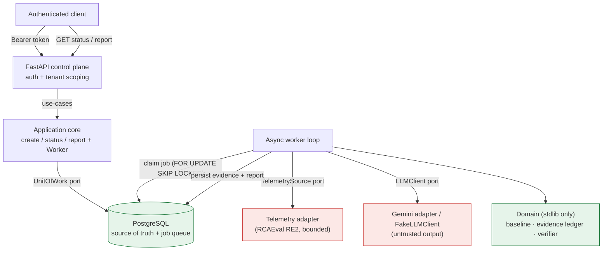
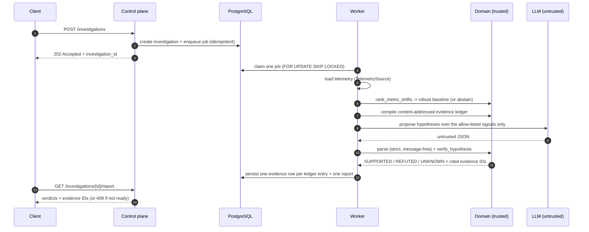

# Incident Evidence Compiler

[](LICENSE)
[](pyproject.toml)
[](#engineering-principles)

A clean-room, production-oriented system for **evidence-grounded incident investigation**: it
compiles microservice telemetry into a replayable, content-addressed evidence ledger, lets a
language model propose *restricted* hypotheses, and **verifies them deterministically** as
`SUPPORTED`, `REFUTED`, or `UNKNOWN` — so every accepted conclusion is tenant-authorized,
temporally valid, replayable, and linked to verifiable evidence.

> **The thesis:** an LLM may *propose*, but trusted, deterministic code *decides*. `UNKNOWN`
> is a first-class answer, distinct from false.

## Status

**Phases 0–9 in progress** — a verified deterministic domain, PostgreSQL persistence with a
`SKIP LOCKED` worker queue, an async LLM provider boundary, a FastAPI control plane, a
real-data evaluation on RCAEval RE2-OB, a dependency-free Prometheus `/metrics` endpoint, and a
runnable entrypoint (`python -m incident_evidence_compiler`) with a multi-stage container image
and a docker-build + smoke gate in CI. See [Roadmap](#roadmap) for what remains for a full v1
(OpenTelemetry spans, a sealed held-out run, production telemetry ingestion).

## Why this exists

Operational incidents produce fragmented and sometimes contradictory metrics, logs, traces,
and deployment events. Language models can summarize this evidence, but they must not be
trusted to invent data access, execute arbitrary queries, or assert unsupported causes.

> How can an AI system propose useful incident hypotheses while every accepted conclusion
> remains tenant-authorized, temporally valid, replayable, and linked to verifiable evidence?

## Architecture

Framework-independent layers with dependency inversion — the domain knows nothing about
FastAPI, PostgreSQL, or the Gemini SDK; infrastructure sits behind ports.



Green = trusted (deterministic domain, durable store). Red = untrusted input (model output
and telemetry) that must pass strict validation before it is believed.

## The verification pipeline



The worker's external LLM call is bounded by a per-attempt deadline; provider failures are
retried then terminal; malformed model output is terminal and records only a stable error
code — never model text.

## Verdict semantics (the output contract)

Every predicate resolves to exactly one three-valued verdict. `UNKNOWN` fails **closed**.

| Verdict | Meaning | Evidence cited |
|---|---|---|
| `SUPPORTED` | The metric shifted in the asserted direction at/above the frozen minimum score. | supporting evidence IDs |
| `REFUTED` | The eligible metric shifted in the **opposite** direction. | contradicting evidence IDs |
| `UNKNOWN` | Evidence is missing, stale, ineligible, weak, context-mismatched, or the claim is causal. | none |

A composed hypothesis is `ALL` (every predicate must hold) or `ANY` (at least one). A causal
claim or a tenant/incident/run context mismatch is `UNKNOWN` by construction — the model
cannot talk its way past the verifier.

## Quickstart

Prerequisites: **Python 3.12** and **uv 0.11.17** (the build/lock tool; exact-pinned).

```bash
uv sync --locked
```

Run the hermetic gate (no database, network, or credentials required):

```bash
uv run --locked python -m unittest discover -s tests -p "test_*.py" -v
uv run --locked ruff check .
uv run --locked ruff format --check .
uv run --locked mypy src tests
uv run --locked python scripts/validate_project.py
```

### HTTP API

The control plane is a FastAPI app built by `create_app(uow_factory=..., tokens=...)`
(`src/incident_evidence_compiler/api/app.py`). Authentication is a static bearer token mapped
to a tenant; every data route is tenant-scoped, and a cross-tenant lookup returns `404` (never
`403`) to avoid leaking existence. `/health` is the only unauthenticated route.

| Method & path | Purpose | Success | Notable errors |
|---|---|---|---|
| `GET /health` | Liveness (open) | `200 {"status":"ok"}` | — |
| `GET /metrics` | Prometheus metrics (open, no tenant/PII labels) | `200 text/plain` | — |
| `POST /investigations` | Open an investigation (idempotent via `Idempotency-Key`) | `202 {"investigation_id"}` | `401 unauthorized`, `422 <code>` |
| `GET /investigations/{id}` | Status | `200 {"investigation_id","status"}` | `401`, `404 investigation_not_found` |
| `GET /investigations/{id}/report` | Verified report | `200 {...,"report":{...}}` | `404`, `409 report_not_ready` |

Request body for `POST /investigations`:

```json
{
  "incident_id": "checkout-2026-07-18",
  "run_id": "run-1",
  "window": {
    "start": "2026-07-18T10:00:00Z",
    "injection": "2026-07-18T10:10:00Z",
    "end": "2026-07-18T10:20:00Z"
  }
}
```

Report response (the deterministic verification result):

```json
{
  "investigation_id": "…",
  "schema_version": "metric-shift-verification.v1",
  "report": {
    "hypothesis_id": "…",
    "composition": "any",
    "verdict": "supported",
    "reason": null,
    "predicate_results": [
      {
        "predicate_id": "p1",
        "verdict": "supported",
        "observed_direction": "increase",
        "supporting_evidence_ids": ["…"],
        "contradicting_evidence_ids": []
      }
    ],
    "supporting_evidence_ids": ["…"]
  }
}
```

All error bodies are a flat `{"code": "<stable_code>"}` — never model text, tenant data, or
internals.

### Run the service

The entrypoint (`python -m incident_evidence_compiler`, ADR 0016) wires the persistence, LLM,
and telemetry ports selected by environment variables into the FastAPI control plane plus an
in-process worker loop. Configuration is environment-only and **fail-fast**: any missing or
invalid value stops startup with a stable, secret-free message.

```bash
# Credential-free local smoke: in-memory store, non-model smoke LLM, no telemetry.
IEC_TOKENS=dev-token=tenant-a uv run --locked python -m incident_evidence_compiler
# -> serves on 127.0.0.1:8000 (GET /health, GET /metrics)
```

```bash
# Real end-to-end: durable PostgreSQL, Gemini via Vertex AI, RCAEval-backed demo telemetry.
IEC_TOKENS=prod-token=tenant-a \
IEC_PERSISTENCE=postgres IEC_DATABASE_URL=postgresql://iec@localhost/iec \
IEC_LLM_PROVIDER=vertex IEC_GEMINI_PROJECT=<gcp-project> IEC_GEMINI_LOCATION=us-central1 \
IEC_TELEMETRY=rcaeval IEC_RE2_ROOT=/path/to/RE2/RE2-OB \
uv run --locked python -m incident_evidence_compiler
```

| Variable | Default | Purpose |
|---|---|---|
| `IEC_TOKENS` | — (required) | `token=tenant` pairs, comma-separated. Never logged. |
| `IEC_PERSISTENCE` | `memory` | `memory` or `postgres` (then `IEC_DATABASE_URL` is required). |
| `IEC_LLM_PROVIDER` | `fake` | `fake` (non-model smoke), `developer` (`GEMINI_API_KEY`), or `vertex` (`IEC_GEMINI_PROJECT`). |
| `IEC_TELEMETRY` | `none` | `none` or `rcaeval` (then `IEC_RE2_ROOT` points at an out-of-repo split). |
| `IEC_BIND_HOST` / `IEC_BIND_PORT` | `127.0.0.1` / `8000` | Listen address (the container image defaults the host to `0.0.0.0`). |

Or build and run the container image (multi-stage `uv` build, non-root, stdlib healthcheck):

```bash
docker build -t incident-evidence-compiler .
docker run --rm -p 8000:8000 -e IEC_TOKENS=dev-token=tenant-a incident-evidence-compiler
curl -fsS http://127.0.0.1:8000/health
```

> **Scope note:** `IEC_LLM_PROVIDER=fake` is a labelled non-model smoke client and
> `IEC_TELEMETRY=rcaeval` is a labelled demo source — there is **no production telemetry
> ingestion** yet (see [Limitations](#limitations)). `/health` and `/metrics` are open by design
> and should be network-restricted at deployment.

### Optional integration checks (excluded from the hermetic gate)

```bash
# PostgreSQL: start a database, point DATABASE_URL at it, then:
docker compose up -d
uv run --locked python -m unittest tests.test_persistence_postgres

# Live Gemini (Developer API key):
GEMINI_API_KEY=… uv run --locked python -m unittest tests.test_llm_gemini
```

### Reproduce the evaluation

RCAEval RE2 data is **never committed** and lives outside the repository (ADR 0009). Point the
loader at your own extracted split:

```bash
# Deterministic baseline arm (no network):
uv run --locked python scripts/run_evaluation.py \
    --root /path/to/RE2/RE2-OB --arm baseline \
    --out docs/evaluation/re2-ob-baseline.json

# Verifier-gated Gemini arm via Vertex AI (ADC) or the Developer API key:
uv run --locked python scripts/run_evaluation.py \
    --root /path/to/RE2/RE2-OB --arm gemini \
    --provider vertex --project <gcp-project> --location us-central1 \
    --model gemini-2.5-flash --concurrency 4 \
    --out docs/evaluation/re2-ob-gemini.json
```

## Evaluation results (RCAEval RE2-OB, development split)

Measured on 88 cases (2 skipped for a trailing-empty-timestamp row); aggregate, label-free
artifacts are committed under [`docs/evaluation/`](docs/evaluation/).

| Arm | Top-1 | Top-3 | MRR | Abstention | Invalid evidence IDs |
|---|---|---|---|---|---|
| Baseline (deterministic) | **0.932** | **0.989** | **0.959** | 0.000 | **0** |
| +Gemini (`gemini-2.5-flash`, verified) | 0.080 (0.159 answered) | 0.091 | 0.085 | 0.500 | **0** |

The deterministic baseline sees the metric values and localizes the injected service well on
the observable split. The Gemini arm receives only signal *names* (never the values), so it
guesses among ~72 signals and often proposes downstream symptoms; the deterministic verifier
gates those guesses (50% abstention, **zero** invalid evidence citations). RE2-OB is the
observable split; RE2-TT stays sealed and RE2-SS reserved, so these are **development**
numbers, not a held-out claim. See
[`docs/decisions/0014-phase-7-real-data-evaluation.md`](docs/decisions/0014-phase-7-real-data-evaluation.md).

## Repository layout

```text
src/incident_evidence_compiler/
  domain/         # stdlib-only: baseline, evidence ledger, verifier, change events, serialization
  persistence/    # psycopg repositories, in-memory fakes, migrations, SKIP LOCKED job queue
  llm/            # async LLMClient protocol, FakeLLMClient, untrusted parser, Gemini adapter
  application/    # framework-independent use-cases + the Worker + TelemetrySource port
  api/            # FastAPI control plane: routes, bearer auth, tenant scoping
  observability/  # stdlib-only Prometheus registry (counters, histograms, /metrics text)
  runtime/        # composition root: env config, wiring, worker loop, python -m entrypoint
  evaluation/
    rcaeval/      # bounded, label-safe RCAEval RE2 adapter + evaluation-only sidecar
    harness/      # baseline-input bridge, scoring, and the two-arm runner
scripts/          # validate_project.py (governance gate), run_evaluation.py
tests/            # hermetic unit/integration tests (fakes + deterministic LLM)
docs/             # decisions (ADRs), devlog, datasets, evaluation artifacts, architecture
```

## Engineering principles

- Contracts before orchestration.
- Deterministic baseline before an LLM.
- `UNKNOWN` is distinct from false.
- PostgreSQL is the durable source of truth.
- Model output is untrusted input.
- External calls are bounded by deadlines and budgets.
- Features must earn their complexity through tests or measurements.
- Documentation must not claim more than committed evidence proves.

## Limitations

- **Development-set evaluation only.** RE2-OB is the observable (easiest) split; RE2-TT stays
  sealed and RE2-SS reserved. No held-out accuracy is claimed.
- **Metrics, but no tracing yet.** A dependency-free Prometheus `/metrics` endpoint exposes
  per-stage latency, job outcomes, provider-timeout rate, token counts, and verdict
  distribution (no tenant/PII labels). OpenTelemetry spans and estimated cost are deferred.
- **No production telemetry ingestion.** The system is runnable (`python -m
  incident_evidence_compiler` / container image), but the only telemetry sources are the
  in-memory fake and a labelled RCAEval-backed **demo** source; a durable, tenant-owned
  telemetry ledger is future work. The worker also runs in-process (single-node v1).
- **The LLM arm is intentionally blind to metric values.** Its low localization accuracy
  reflects that design (the verifier is the source of truth), not a defect.
- **The baseline policy is a documented default,** not a calibrated risk–coverage curve.
- **Single-node PostgreSQL queue.** Redis admission control is deferred (ADR 0007).

## Roadmap

- Observability: OpenTelemetry spans per stage and estimated cost (Prometheus counters and
  stage-latency histograms are already exposed at `/metrics`).
- Production telemetry ingestion (a durable, tenant-owned source beyond the RCAEval demo bridge)
  and an optional separate worker process.
- A single, authorized sealed RE2-TT run for a held-out number.

## Provenance

This is an independent rewrite. It contains no source copied from
`yashprogrammer/EnterpriseRAG_live`, which was audited as a learning prototype and is cited in
[`docs/provenance.md`](docs/provenance.md).

## License

Source, documentation, and configuration are licensed under the Apache License 2.0 — see
[`LICENSE`](LICENSE) and
[`docs/decisions/0008-apache-2.0-license.md`](docs/decisions/0008-apache-2.0-license.md).
RCAEval dataset licensing is separate and documented in
[`docs/datasets/rcaeval-re2.md`](docs/datasets/rcaeval-re2.md); raw benchmark data is never
committed.

## Project governance

- [`PROJECT_CONTEXT.md`](PROJECT_CONTEXT.md) — compact current state loaded by the project agent.
- [`AGENTS.md`](AGENTS.md) — agent and contributor operating contract.
- [`MASTER-PLAN.md`](MASTER-PLAN.md) — the sprint plan and v1 release gates.
- [`.kiro/steering/`](.kiro/steering/) — persistent workspace rules.
- [`docs/decisions/`](docs/decisions/) — architecture decision records.
- [`docs/devlog/`](docs/devlog/) — evidence-based phase journals.
- [`docs/architecture/overview.md`](docs/architecture/overview.md) — component and trust-boundary detail.
