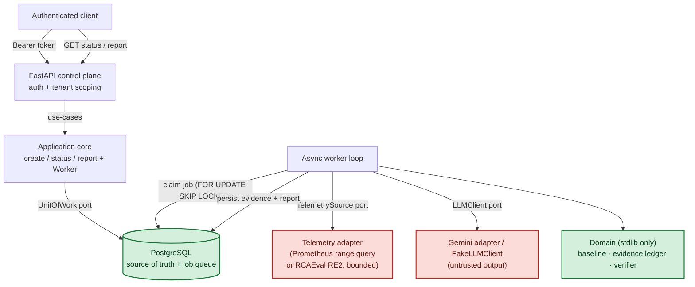
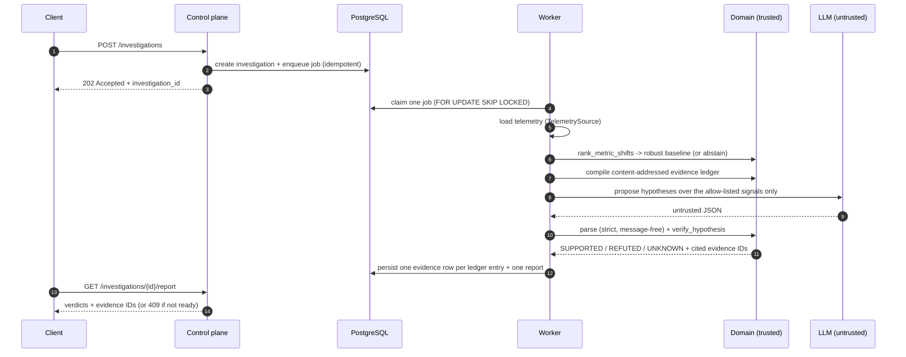

# Incident Evidence Compiler

[](https://github.com/AswaniSahoo/Incident-evidence-compiler/actions/workflows/ci.yml)
[](tests/)
[](pyproject.toml)
[](pyproject.toml)
[](#principles-the-ones-i-actually-held)
[](LICENSE)

An incident-investigation service where a language model is allowed to *guess*, but only
deterministic code is allowed to *decide*.

It takes microservice telemetry, compiles it into a content-addressed evidence ledger, and lets
Gemini propose restricted hypotheses over an allow-list of signals. Every hypothesis is then
checked by a deterministic verifier that returns one of three answers: `SUPPORTED`, `REFUTED`,
or `UNKNOWN`. Nothing the model says is trusted until the verifier agrees, and `UNKNOWN` is a
real answer, not a polite way of saying "no."

The whole thing is built the way I'd build a real backend: framework-independent domain,
PostgreSQL as the source of truth, a `SKIP LOCKED` worker queue, every external call on a
deadline, and a test suite that runs with no database, no network, and no credentials.

## The system refusing a plausible answer

**Live run, 2026-08-23.** A fault is injected into `bank_router`, shaped like a bad deploy.
`ledger_db` is a healthy decoy: a database-shaped signal a model is tempted to blame. Gemini sees
only signal *names*, never values, and proposed one hypothesis over four predicates. The
deterministic verifier resolved each against the ingested evidence ledger:

| Predicate Gemini proposed | Verdict | Grounds |
|---|---|---|
| `bank_router_latency_increase` | **`SUPPORTED`** | evidence `sha256:758e1134...`, the injected fault |
| `checkout_error_increase` | `UNKNOWN` | `weak_evidence`, checkout never moved |
| `ledger_db_error_increase` | `UNKNOWN` | `weak_evidence`, **the decoy, refused** |
| `upi_switch_latency_increase` | `UNKNOWN` | `weak_evidence`, never moved |

**One verified true. Three guesses withheld. Zero false assertions.** The one it got right was a
guess too: it cannot see a single value. The difference is that the verifier could check that one
against the ledger and could not check the other three. The model was wrong three times out of four
and the system was still right, because being wrong never became a conclusion.

Reproduce it in about three minutes: [the demo](#demo-a-real-prometheus-with-synthetic-data).

> [!NOTE]
> **The telemetry in this demo is synthetic.** It comes from
> [an exporter in this repo](scripts/demo_anomaly_exporter.py) that says so in its own docstring.
> The run is otherwise real end to end: a real Prometheus v3.6.0 range query, a real worker, a real
> Vertex `gemini-2.5-flash` call, and the real deterministic verifier. It proves the ingestion path
> and the verification gate. It does **not** prove diagnostic accuracy on production payment
> telemetry, and nothing here claims that it does.

## What is actually interesting here

If you read one section, read this one. Every item links to the code or the artifact behind it.

- **The model physically cannot say anything dangerous.** Gemini returns fixed JSON: a signal id
  drawn from a caller-supplied allow-list, `INCREASE` or `DECREASE`, `ALL` or `ANY`. There is no
  field for free text, for SQL, or for a shell command.
  [`llm/parsing.py`](src/incident_evidence_compiler/llm/parsing.py) caps untrusted input at 65,536
  characters and 32 predicates *before* parsing, checks every signal against the allow-list *after*
  structural validation, and raises message-free typed errors, so no model-derived string is ever
  retained or echoed back.
- **Evidence is content-addressed.** Each ledger entry's ID is a sha256 over its own content, so a
  citation cannot drift from the thing it cites, and a report replays byte for byte.
  [`domain/evidence/`](src/incident_evidence_compiler/domain/evidence/)
- **`UNKNOWN` is a verdict, not a failure.** Tenant or run mismatch, causal claims, and weak
  evidence all fail closed to `UNKNOWN` rather than collapsing to "no."
  [`domain/verifier.py`](src/incident_evidence_compiler/domain/verifier.py)
- **Malformed telemetry cannot exist as a domain object.** `NaN`, infinities, and non-monotonic
  timestamps are rejected in `__post_init__`, so no downstream code has to remember to check for
  them. [`domain/metrics.py`](src/incident_evidence_compiler/domain/metrics.py)
- **The untrusted boundaries are fuzzed, and the fuzzer itself was audited.** 3,000 generated
  hostile inputs assert that only typed errors ever escape. The first version passed while covering
  the allow-list branch zero times out of 1,500 cases; measuring the outcome distribution exposed
  that, and a hallucinated-signal strategy took it to 133.
  [`tests/test_fuzz_boundaries.py`](tests/test_fuzz_boundaries.py),
  [devlog 0016](docs/devlog/0016-boundary-fuzzing-and-hygiene.md)
- **The job queue is real.** `SELECT ... FOR UPDATE SKIP LOCKED` with leases, retries and idempotent
  commits, verified against a real `postgres:16` by a two-worker race test.
  [devlog 0014](docs/devlog/0014-postgres-skip-locked-evidence.md)
- **The evaluation was sealed.** RE2-TT was opened exactly once, against a frozen commit, with no
  tuning against it. [Protocol](docs/evaluation/re2-tt-sealed-protocol.md)
- **19 ADRs record what was cut, and why**, including what was deliberately *not* built:
  model-generated SQL, shell access, autonomous remediation, and multi-agent orchestration.
  [`docs/decisions/`](docs/decisions/)

## Results

Measured on the RCAEval RE2-OB **development** split, 88 cases (2 skipped for a truncated final
row). Metrics are aggregate and label-free; the raw artifacts live in
[`docs/evaluation/`](docs/evaluation/).

| Arm | Top-1 | Top-3 | MRR | Abstention | Invalid evidence IDs |
|---|---|---|---|---|---|
| Baseline (deterministic) | **0.932** | **0.989** | **0.959** | 0.000 | 0 |
| + Gemini (`gemini-2.5-flash`, verified) | 0.080 (0.159 answered) | 0.091 | 0.085 | 0.500 | 0 |

Here's the honest part, because it's the interesting part. The deterministic baseline sees the
actual metric values and localizes the faulty service well. The Gemini arm is handed only the
signal *names*, never the values, so it's guessing among ~72 signals, and it often names a
downstream symptom instead of the cause. It does badly. That's fine. The point of the system is
that the verifier gates those guesses: the model abstained or got filtered half the time, and it
produced **zero** invalid evidence citations. The LLM can be wrong without the system being
wrong.

### Held-out (sealed RE2-TT)

Opened once, on 2026-07-19, against a frozen configuration (commit `0a7854e`), the same
thresholds and model as the development run, no tuning against TT. 90 cases, 0 skipped. This is
the [sealed-run protocol](docs/evaluation/re2-tt-sealed-protocol.md) executed exactly once;
artifacts: [`re2-tt-baseline.json`](docs/evaluation/re2-tt-baseline.json),
[`re2-tt-gemini.json`](docs/evaluation/re2-tt-gemini.json).

| Arm | Top-1 | Top-3 | MRR | Abstention | Invalid evidence IDs |
|---|---|---|---|---|---|
| Baseline (deterministic) | **0.767** | **0.878** | **0.833** | 0.000 | 0 |
| + Gemini (`gemini-2.5-flash`, verified) | 0.156 (0.368 answered) | 0.156 | 0.156 | 0.578 | 0 |

The held-out numbers hold the same shape as development, on a completely different system
(train-ticket, not the dev split): the deterministic baseline localizes well (Top-1 0.77), and
the verifier-gated Gemini arm stays conservative, it abstained on 52 of 90 cases rather than
assert an unverified cause, and again produced **zero** invalid evidence citations. Accuracy
drops from the dev split (harder, unseen system), which is the honest and expected direction.
Method notes: [ADR 0014](docs/decisions/0014-phase-7-real-data-evaluation.md).

## The question I was trying to answer

Real incidents throw off a mess of metrics, logs, traces, and deploy events that don't always
agree with each other. An LLM is genuinely good at reading that mess and summarizing it. What it
should never be allowed to do is invent a data source, run a query, or assert a cause you can't
check.

So: how do you let a model help with incident triage while keeping every accepted conclusion
tenant-scoped, valid for the time window it claims, replayable byte-for-byte, and tied to
evidence you can point at? This repo is my answer.

## How it works

The domain knows nothing about FastAPI, PostgreSQL, or the Gemini SDK. Everything external sits
behind a port, which is what makes the domain testable in isolation and the infrastructure
swappable.



Green is trusted: the deterministic domain and the durable store. Red is untrusted input, model
output and raw telemetry, which has to pass strict validation before anyone believes it.

And here's a single investigation end to end:



The call out to the model is bounded by a per-attempt deadline. A provider failure is retried
and then gives up; malformed model output is terminal and records only a stable error code,
never the model's text. A stalled model can't wedge the worker.

## What the verifier actually promises

Every predicate resolves to exactly one of three verdicts, and `UNKNOWN` fails closed.

| Verdict | When | Evidence cited |
|---|---|---|
| `SUPPORTED` | The metric shifted in the asserted direction, at or above the frozen minimum score. | supporting IDs |
| `REFUTED` | The eligible metric shifted the *opposite* way. | contradicting IDs |
| `UNKNOWN` | Evidence is missing, stale, ineligible, too weak, context-mismatched, or the claim is causal. | none |

A composed hypothesis is either `ALL` (every predicate must hold) or `ANY` (at least one). A
causal claim, or a tenant/incident/run that doesn't match the ledger, comes back `UNKNOWN` by
construction. There's no prompt that talks its way past this, because the verdict is decided by
code that never reads the prompt.

## Quickstart

You need Python 3.12 and uv 0.11.17 (the lock/build tool, exact-pinned).

```bash
uv sync --locked
```

Run the hermetic gate. No database, no network, no credentials:

```bash
uv run --locked python -m unittest discover -s tests -p "test_*.py" -v
uv run --locked ruff check .
uv run --locked ruff format --check .
uv run --locked mypy src tests
uv run --locked python scripts/validate_project.py
```

## Run the service

`python -m incident_evidence_compiler` wires the persistence, LLM, and telemetry ports from
environment variables into the control plane plus an in-process worker loop (ADR 0016). Config
is environment-only and fail-fast: a missing or invalid value stops startup with a stable,
secret-free message instead of booting into a half-configured state.

```bash
# Credential-free smoke: in-memory store, non-model smoke client, no telemetry.
IEC_TOKENS=dev-token=tenant-a uv run --locked python -m incident_evidence_compiler
# serves 127.0.0.1:8000  (GET /health, GET /metrics)
```

```bash
# The real thing: PostgreSQL, Gemini on Vertex AI, RCAEval-backed demo telemetry.
IEC_TOKENS=prod-token=tenant-a \
IEC_PERSISTENCE=postgres IEC_DATABASE_URL=postgresql://iec@localhost/iec \
IEC_LLM_PROVIDER=vertex IEC_GEMINI_PROJECT=<gcp-project> IEC_GEMINI_LOCATION=us-central1 \
IEC_TELEMETRY=rcaeval IEC_RE2_ROOT=/path/to/RE2/RE2-OB \
uv run --locked python -m incident_evidence_compiler
```

```bash
# Live metrics instead: range-query a Prometheus over each incident's own window.
# Selectors are semicolon-separated, because PromQL label lists already use commas.
IEC_TOKENS=prod-token=tenant-a \
IEC_TELEMETRY=prometheus IEC_PROM_URL=http://prom:9090 \
IEC_PROM_QUERIES='sum by (service) (rate(http_request_duration_seconds_sum[1m])) ; sum by (service) (rate(http_requests_total{code=~"5.."}[1m]))' \
uv run --locked python -m incident_evidence_compiler
```

| Variable | Default | Purpose |
|---|---|---|
| `IEC_TOKENS` | required | `token=tenant` pairs, comma-separated. Never logged. |
| `IEC_PERSISTENCE` | `memory` | `memory`, or `postgres` (then `IEC_DATABASE_URL` is required). |
| `IEC_LLM_PROVIDER` | `fake` | `fake` (non-model smoke), `developer` (`GEMINI_API_KEY`), or `vertex` (`IEC_GEMINI_PROJECT`). |
| `IEC_TELEMETRY` | `none` | `none`, `rcaeval` (then `IEC_RE2_ROOT` points at an out-of-repo split), or `prometheus`. |
| `IEC_PROM_URL` | required for `prometheus` | Base URL of the Prometheus to range-query, e.g. `http://prom:9090`. |
| `IEC_PROM_QUERIES` | required for `prometheus` | PromQL selectors, **semicolon**-separated (PromQL label lists contain commas). |
| `IEC_PROM_STEP_SECONDS` | `30` | Range-query sample step. |
| `IEC_PROM_TIMEOUT_SECONDS` | `30` | Per-query deadline. With several selectors, budget accordingly. |
| `IEC_PROM_BEARER_TOKEN` | unset | Optional bearer credential. Never logged and never echoed in an error. |
| `IEC_BIND_HOST` / `IEC_BIND_PORT` | `127.0.0.1` / `8000` | Listen address (the container image binds `0.0.0.0`). |

Or run the container. It's a multi-stage uv build, runs as a non-root user, and health-checks
`/health` with the standard library (no curl in the image):

```bash
docker build -t incident-evidence-compiler .
docker run --rm -p 8000:8000 -e IEC_TOKENS=dev-token=tenant-a incident-evidence-compiler
curl -fsS http://127.0.0.1:8000/health
```

One thing I want to be straight about: `IEC_LLM_PROVIDER=fake` is a labelled smoke client, not a
model, and `IEC_TELEMETRY=rcaeval` is a demo bridge over the benchmark, not a production
ingestion path. `IEC_TELEMETRY=prometheus` *is* the real ingestion path, and it has been run
against a real Prometheus, fed synthetic data, see [the demo](#demo-a-real-prometheus-with-synthetic-data).
`/health` and `/metrics` are open on purpose; put them behind your network boundary when you
deploy.

## HTTP API

The control plane is built by `create_app(uow_factory=..., tokens=...)` in
[`api/app.py`](src/incident_evidence_compiler/api/app.py). Auth is a static bearer token mapped
to a tenant. Every data route is tenant-scoped, and a cross-tenant lookup returns `404`, not
`403`, so you can't probe for which investigations exist. `/health` and `/metrics` are the only
open routes.

| Method & path | Purpose | Success | Notable errors |
|---|---|---|---|
| `GET /health` | Liveness (open) | `200 {"status":"ok"}` |, |
| `GET /metrics` | Prometheus text (open, no tenant/PII labels) | `200 text/plain` |, |
| `POST /investigations` | Open an investigation (idempotent via `Idempotency-Key`) | `202 {"investigation_id"}` | `401`, `422 <code>` |
| `GET /investigations/{id}` | Status | `200 {"investigation_id","status"}` | `401`, `404 investigation_not_found` |
| `GET /investigations/{id}/report` | Verified report | `200 {...,"report":{...}}` | `404`, `409 report_not_ready` |

`POST /investigations` body:

```json
{
  "incident_id": "checkout-2026-07-18",
  "run_id": "run-1",
  "window": {
    "start": "2026-07-18T10:00:00Z",
    "injection": "2026-07-18T10:10:00Z",
    "end": "2026-07-18T10:20:00Z"
  }
}
```

The report you get back is the verification result:

```json
{
  "investigation_id": "…",
  "schema_version": "metric-shift-verification.v1",
  "report": {
    "hypothesis_id": "…",
    "composition": "any",
    "verdict": "supported",
    "reason": null,
    "predicate_results": [
      {
        "predicate_id": "p1",
        "verdict": "supported",
        "observed_direction": "increase",
        "supporting_evidence_ids": ["…"],
        "contradicting_evidence_ids": []
      }
    ],
    "supporting_evidence_ids": ["…"]
  }
}
```

Every error body is a flat `{"code": "<stable_code>"}`. No model text, no tenant data, no
internals cross the boundary.

## Demo: a real Prometheus with synthetic data

The `demo` compose profile stands up a real Prometheus scraping a small synthetic exporter, and
points the ingestion path at it. Everything about the plumbing is genuine, a real Prometheus, a
real range query, the real worker and verifier. Only the *numbers* are invented, and the exporter
says so in its own docstring.

The scenario is a **payment-routing incident** (ADR 0018). Four components, `bank_router`,
`checkout`, `upi_switch`, `ledger_db`, sit flat until a published instant, when `bank_router`, as
if a bad deploy just shipped, degrades: its latency and error ratio climb an order of magnitude
while the rest stay healthy. `ledger_db` is a deliberate decoy, a database-shaped signal a model
is tempted to blame. This is the shape of a fintech reliability bar (*every money action
explainable, bounded and gated*) with IEC's twist: the model may propose, but only the verifier
decides.

```bash
docker compose --profile demo up -d --build
uv run --locked python scripts/demo_live_investigation.py   # ~3 min: waits for the window to fill
docker compose --profile demo down -v
```

The driver reads the exporter's own `demo_injection_unixtime` so the incident window straddles the
fault exactly instead of by guesswork, waits for Prometheus to scrape both sides, then submits one
investigation and polls for the verified report.

This is what it printed on 2026-08-23, verbatim, running against Vertex `gemini-2.5-flash`:

```console
$ uv run --locked python scripts/demo_live_investigation.py
waiting for the demo stack
  exporter ready at http://127.0.0.1:9101/metrics
  compiler ready at http://127.0.0.1:8000/health
injection at 2026-08-23T10:12:11Z; window 2026-08-23T10:10:11Z .. 2026-08-23T10:14:11Z
investigation 2c93d390-8d92-4109-bab3-d490de5fefc9 accepted; polling for the report

verdict: supported
  checkout_error_increase: unknown observed=increase supporting=0 contradicting=0
  bank_router_latency_increase: supported observed=increase supporting=1 contradicting=0
  ledger_db_error_increase: unknown observed=decrease supporting=0 contradicting=0
  upi_switch_latency_increase: unknown observed=decrease supporting=0 contradicting=0
```

The `supporting=1` on the one accepted predicate is a cited evidence ID, not a confidence score.
Pulled from the same report:

```json
{
  "predicate_id": "bank_router_latency_increase",
  "verdict": "supported",
  "observed_direction": "increase",
  "supporting_evidence_ids": [
    "sha256:758e1134587717a172b0a90bc4d5b5ab21986d5cd49d18996645f4f03cb98f5f"
  ],
  "reason": null
}
```

That hash addresses the exact ledger entry the verdict rests on. Look it up and you get the same
bytes the verifier read.

**With a real model (2026-08-23).** Run with `IEC_LLM_PROVIDER=vertex` (`gemini-2.5-flash` on a
dedicated GCP project, ADC only, no credential in any container). Gemini, which sees only signal
*names* and never a single value, proposed a four-predicate hypothesis
(`payment_transaction_degradation`) casting a wide net across the payment surface. The verifier
resolved each predicate against the live data:

| Predicate Gemini proposed | Verdict | Grounds |
|---|---|---|
| `bank_router_latency_increase` | **`supported`** | cited evidence `sha256:758e…`, the real injected fault |
| `checkout_error_increase` | **`unknown`** | `weak_evidence`, checkout never moved |
| `ledger_db_error_increase` | **`unknown`** | `weak_evidence`, the decoy; the model reached for the database, the data didn't |
| `upi_switch_latency_increase` | **`unknown`** | `weak_evidence`, never moved |

**One verified-true, three guesses withheld, zero false assertions.** The model over-reached four
ways; the verifier endorsed only the single claim real evidence supported, including refusing the
tempting `ledger_db` decoy. That is the whole thesis in one report: the LLM is allowed to guess,
only deterministic code is allowed to decide, and being wrong three times out of four costs nothing
because none of it became a conclusion.

**Without a model at all.** The same run with `IEC_LLM_PROVIDER=fake` (a smoke client needing no
API, which names the lexicographically-first ingested signal, here `bank_router`'s error ratio)
returned **`supported`** citing `sha256:8a99…`, proof the ingestion path carries real evidence end
to end without any provider.

Pulling the plug is also covered: with Prometheus stopped, an investigation terminates as `failed`
with no retry storm, and nothing about the transport reaches the logs.

## Optional integration checks

These are excluded from the hermetic gate because they need real infrastructure:

```bash
# PostgreSQL:
docker compose up -d
uv run --locked python -m unittest tests.test_persistence_postgres

# Live Gemini (Developer API key):
GEMINI_API_KEY=… uv run --locked python -m unittest tests.test_llm_gemini
```

The PostgreSQL suite was last verified green on 2026-08-23, **8 tests against `postgres:16`**,
including the two-worker `FOR UPDATE SKIP LOCKED` race (`test_two_workers_claim_each_job_exactly_once`).
See [devlog 0014](docs/devlog/0014-postgres-skip-locked-evidence.md).

## Reproduce the evaluation

The RCAEval RE2 data is never committed and lives outside the repo (ADR 0009). Point the loader
at your own extracted split:

```bash
# Deterministic baseline arm (no network):
uv run --locked python scripts/run_evaluation.py \
    --root /path/to/RE2/RE2-OB --arm baseline \
    --out docs/evaluation/re2-ob-baseline.json

# Verifier-gated Gemini arm (Vertex AI via ADC, or a Developer API key):
uv run --locked python scripts/run_evaluation.py \
    --root /path/to/RE2/RE2-OB --arm gemini \
    --provider vertex --project <gcp-project> --location us-central1 \
    --model gemini-2.5-flash --concurrency 4 \
    --out docs/evaluation/re2-ob-gemini.json
```

## Layout

```text
src/incident_evidence_compiler/
  domain/         # stdlib only: baseline, evidence ledger, verifier, change events, serialization
  persistence/    # psycopg repositories, in-memory fakes, migrations, SKIP LOCKED job queue
  llm/            # async LLMClient protocol, FakeLLMClient, untrusted parser, Gemini adapter
  application/    # framework-independent use-cases + the Worker + TelemetrySource port
  api/            # FastAPI control plane: routes, bearer auth, tenant scoping
  observability/  # stdlib-only Prometheus registry (counters, histograms, /metrics text)
  runtime/        # composition root: env config, wiring, worker loop, Prometheus ingestion, entrypoint
  evaluation/
    rcaeval/      # bounded, label-safe RCAEval RE2 adapter + evaluation-only sidecar
    harness/      # baseline-input bridge, scoring, two-arm runner
scripts/          # validate_project.py (governance gate), run_evaluation.py
tests/            # hermetic unit/integration tests (fakes + deterministic LLM)
docs/             # decisions (ADRs), devlog, datasets, evaluation artifacts, architecture
```

## Principles (the ones I actually held)

- Write the contracts before the orchestration.
- Get a deterministic baseline working before adding a model.
- Treat `UNKNOWN` as a first-class answer, not a rounding error toward "no."
- PostgreSQL is the source of truth; everything else is a cache or a guess.
- Model output is untrusted input, always, everywhere.
- Every external call gets a deadline.
- A feature earns its complexity with a test or a measurement, or it doesn't ship.
- The README never claims more than a committed artifact can back up.

## What it doesn't do (yet)

I'd rather list this plainly than let you find it the hard way.

- **The held-out run is a single frozen pass.** RE2-TT was opened once (2026-07-19) for the
  numbers above; RE2-SS stays reserved. The held-out result is deliberately not re-run or tuned.
- **The LLM arm is deliberately blind to metric values.** Its low accuracy is the design working
  as intended (the verifier is the source of truth), not a bug I forgot to fix.
- **Prometheus ingestion is proven against a real Prometheus, but only with synthetic data.** The
  bundled `demo` profile runs a real Prometheus scraping a synthetic exporter, and the full path
  has been exercised end to end (see [the demo](#demo-a-real-prometheus-with-synthetic-data)). The
  numbers are invented, so this says nothing about accuracy on real production telemetry, it
  proves the ingestion, not the diagnosis.
- **Telemetry selectors are process-wide, not per tenant.** With `IEC_TELEMETRY=prometheus` the
  PromQL selectors come from environment config, so every tenant a process authenticates sees the
  same metrics. Per-tenant, per-incident queries need schema and API work, and are deferred.
- **No durable, tenant-owned telemetry ledger.** The worker also runs in-process; splitting it out
  is a later change.
- **Metrics, but no tracing.** There's a dependency-free Prometheus `/metrics` endpoint (per-stage
  latency, job outcomes, provider-timeout rate, token counts, verdict distribution, no PII).
  OpenTelemetry spans and cost estimation are deferred.
- **The baseline policy is a sensible default,** not a calibrated risk–coverage curve.
- **Single-node Postgres queue.** Redis admission control is deferred (ADR 0007).

## Roadmap

- Make the Prometheus selectors per-tenant instead of process-wide, expose the baseline's ranking
  through the API (the live demo had to be inspected out of band), and split the worker into its
  own process.
- Make the evaluation harness stream cases (score-one-discard-one) so the full RE2-TT split runs
  without holding all cases in memory, the sealed run currently needs the whole split resident.
- OpenTelemetry spans per stage and an estimated-cost metric (the Prometheus counters and latency
  histograms already ship at `/metrics`).

## Provenance

This is an independent rewrite. No source is copied from `yashprogrammer/EnterpriseRAG_live`,
which I audited as a learning reference and cite in [`docs/provenance.md`](docs/provenance.md).

## License

Source, docs, and config are Apache-2.0, see [`LICENSE`](LICENSE) and
[ADR 0008](docs/decisions/0008-apache-2.0-license.md). RCAEval dataset licensing is separate and
documented in [`docs/datasets/rcaeval-re2.md`](docs/datasets/rcaeval-re2.md); the raw benchmark
data is never committed.

## If you want to read further

- [`docs/decisions/`](docs/decisions/), the 19 ADRs, where the real design arguments are.
- [`docs/devlog/`](docs/devlog/), a phase-by-phase journal with the evidence behind each claim.
- [`docs/architecture/overview.md`](docs/architecture/overview.md), components and trust
  boundaries in more detail.
- [`AGENTS.md`](AGENTS.md), the operating contract for anyone (human or agent) working in here.
