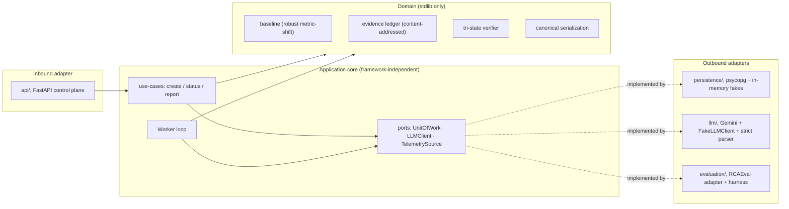
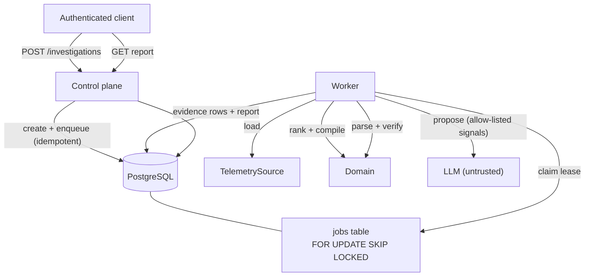

# Architecture Overview

## Status

Implemented through Phase 7: the deterministic domain, PostgreSQL persistence with a
`SKIP LOCKED` job queue, the async LLM provider boundary, the FastAPI control plane and
worker, and the label-safe RCAEval RE2 evaluation harness. Observability (Phase 8) and a
production server entrypoint are not yet implemented.

## Layers and dependency inversion

The domain is standard-library only and knows nothing about frameworks or infrastructure.
Everything else depends inward through ports (protocols); adapters implement them.

## Data and job flow

## Trust boundaries

- Identity establishes tenant context; request bodies cannot choose it. Every data query is
  tenant-scoped, and a cross-tenant read returns `404`, never `403`.
- PostgreSQL is the durable source of truth; only application-owned parameterized queries
  reach it (via `psycopg`).
- Telemetry is untrusted evidence, loaded through a bounded adapter.
- Gemini output is an untrusted proposal, constrained to an allow-listed signal set and a
  strict, message-free parser, then decided by the deterministic verifier.
- A report is accepted only after local evidence and policy validation; error surfaces carry
  only stable codes, never model text or tenant data.
- Evaluation ground-truth labels live in an evaluation-only sidecar and never reach
  investigation code or any committed artifact.

## Delivery semantics

The worker queue is PostgreSQL-backed with leases and `SELECT … FOR UPDATE SKIP LOCKED`.
Delivery is at least once; a per-attempt deadline bounds the external LLM call. Provider
failures are retried up to a cap and then terminal; malformed model output is terminal and
records only a stable `error_code`. Stage and result commits are idempotent.

## Deferred choices

- **Observability (Phase 8):** OpenTelemetry spans per stage and a Prometheus `/metrics`
  endpoint (request count, stage p50/p95, provider timeout rate, token/cost) are planned.
- **Production entrypoint / container image:** wiring a live `UnitOfWork` + token registry +
  worker under `uvicorn` and a Docker build in CI are future work.
- **Redis admission control, Qdrant/retrieval, SSE, and a frontend** are cut or deferred per
  ADR 0007 and require measured or user-facing justification.
